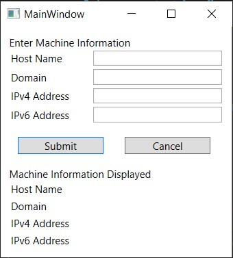

# The WPF Cookbook

[toc]

## General Notes

Keep in mind that in the Microsoft documentation site, the samples can be downloaded from GitHub and for learning purposes.

The scope of this cookbook should focus on smaller implementations.

Also there needs to be a practice set, and a practice set program for daily practices of the WPF  implementations and ideas.


## ValidationRule

Validation Rules are WPF's way to validate input data.

### Problem

### Solution

### There's More

### References

## BindingGroup

Binding Groups contain a collection of bindings and validation rules that are used to validate an object.

Consider this: you have a WPF form, and in it there is a field that want users to enter an IP Address. How do we make sure that the user enters a string that the can be parse as one?

Should we make a `IPAddress.TryParse()` exception to capture that error string input? Well, sure, that is one way to do it. But consider the inconvenience:

-  It is not inherently responsive. You need to write your own Events and EventArgs classes to capture that error. 
- What about other types of Validation, not just for IP address? We need multiple different implementation for each validation rule.

The WPF carries with it the inherent feature called `BindingGroup` and `ValidationRule` that can help us manage and better implement different validation rules, and also provides interfaces for controls to render different appearances based on the status of the validation.

Binding Group also solves the problem of overarching validations. For example, we don't need to create logic for a class or event handler to check for all items being valid and then allow the submission, we can use the binding group to do that.

### Problem

You want to write validation rules for your form, which, depending on user's input, render different appearances.

For the Application (or, current input page), we want to validate all and then allow submission.

### Solution

Step 1: Create a new project in Visual Studio for WPF .net framework.

Step 2: Convert the project into MVVM structure

- Delete MainWindow.xaml
- Create folder Models, ViewModels, Views
- Create new Window class file under Views named "MainWindow.xaml"
- Modify the App.xaml file:

```xaml
<Application
             ...
             StartupUri="Views/MainWindow.xaml">
</Application>
```

Step 3:  In the Views/MainWindow.xaml file, write structure for the application:

```xaml
<StackPanel>
    <StackPanel.Resources>
        <Style TargetType="HeaderedContentControl">
        </Style>
        <Style TargetType="Button"></Style>
    </StackPanel.Resources>
    <StackPanel.BindingGroup>
        <BindingGroup>
        </BindingGroup>
    </StackPanel.BindingGroup>
    <TextBlock Text="Enter Machine Information"/>
    <HeaderedContentControl Header="Host Name">
    	<TextBox Name="hostnameField" Width="150">
        </TextBox>
    </HeaderedContentControl>
    <HeaderedContentControl Header="Domain">
    	<TextBox Name="domainField" Width="150">
        </TextBox>
    </HeaderedContentControl>
    <HeaderedContentControl Header="IPv4 Address">
    	<TextBox Name="ipv4Field" Width="150">
        </TextBox>
    </HeaderedContentControl>
    <HeaderedContentControl Header="IPv6 Address">
    	<TextBox Name="ipv6Field" Width="150">
        </TextBox>
    </HeaderedContentControl>
    <StackPanel Orientation="Horizontal">
    	<Button IsDefault="True" Click="Submit_Clicked">_Submit</Button>
        <Button IsCancel="True" Click="Cancel_Clicked">_Cancel</Button>
    </StackPanel>
    <TextBlock Text="Machine Information Displayed"/>
    <HeaderedContentControl Header="Host Name">
    	<TextBlock Width="150">
        </TextBlock>
    </HeaderedContentControl>
    <HeaderedContentControl Header="Domain">
    	<TextBlock Width="150">
        </TextBlock>
    </HeaderedContentControl>
    <HeaderedContentControl Header="IPv4 Address">
    	<TextBlock Width="150">
        </TextBlock>
    </HeaderedContentControl>
    <HeaderedContentControl Header="IPv6 Address">
    	<TextBlock Width="150">
        </TextBlock>
    </HeaderedContentControl>
</StackPanel>
```

Step 4: Populate Styles for each control Element inside the stack panel

```xaml
    <StackPanel Name="stackPanel1" Margin="10" Width="250"
                Loaded="stackPanel1_Loaded"
                Validation.Error="ItemError">
        <StackPanel.Resources>
            <Style TargetType="HeaderedContentControl">
                <Setter Property="Margin" Value="2"/>
                <Setter Property="Focusable" Value="False"/>
                <Setter Property="Template">
                    <Setter.Value>
                        <ControlTemplate TargetType="HeaderedContentControl">
                            <DockPanel LastChildFill="False">
                                <ContentPresenter ContentSource="Header" DockPanel.Dock="Left" Focusable="False" VerticalAlignment="Center" />
                                <ContentPresenter ContentSource="Content" 
Margin="5 0 0 0" DockPanel.Dock="Right" VerticalAlignment="Center" />
                                
                            </DockPanel>
                        </ControlTemplate>
                    </Setter.Value>
                </Setter>
                
            </Style>
            <Style TargetType="Button">
                <Setter Property="Width" Value="100"/>
                <Setter Property="Margin" Value="10 15 15 15"/>
            </Style>
            ...
        </StackPanel.Resources>
```

So far the XAML file presents basic UI for the application and gives the application a structured and neat look:



Step 5: Create Binding Object `MachineInfo` in Models folder, populate it with 4 fields: Hostname, Domain, IPv4Address, and IPv6Address

```c#
using System.Net;

namespace WPF_GroupBinding_Example.Models
{
    class MachineInfo
    {
        private string hostname;

        public string HostName
        {
            get { return hostname; }
            set { hostname = value; }
        }

        private string domain;

        public string Domain
        {
            get { return domain; }
            set { domain = value; }
        }

        private IPAddress ipv4address;

        public IPAddress IPv4Address
        {
            get { return ipv4address; }
            set { ipv4address = value; }
        }

        private IPAddress ipv6address;

        public IPAddress IPv6Address
        {
            get { return ipv6address; }
            set { ipv6address = value; }
        }

    }
}
```

Step 6: Create MainWindowViewModels.cs file under ViewModels Folder

```C#
using WPF_GroupBinding_Example.Models;

namespace WPF_GroupBinding_Example.ViewModels
{
    class MainWindowViewModels
    {
        public MachineInfo FormMachineInfo { get; set; }

    }
}
```

Step 7: Bind the view model to the MainWindow.xaml.cs on the Stack Panel Load event handler

```c#
...
private void stackPanel1_Loaded(object sender, RoutedEventArgs e)
        {
            stackPanel1.DataContext = new MachineInfo();
        }
...
```

Step 8: Bind the object in MainWindow.xaml controls.

<span style="color:white;background:red">Note from author: The example on the website is not complete, need to have more skills.</span>

### There's More

### References

Microsoft. (2018, April 30). *BindingGroup Class (System.Windows.Data) | Microsoft Docs*. Retrieved from Microsoft Documentation: https://docs.microsoft.com/en-us/dotnet/api/system.windows.data.bindinggroup?view=netcore-3.1

 